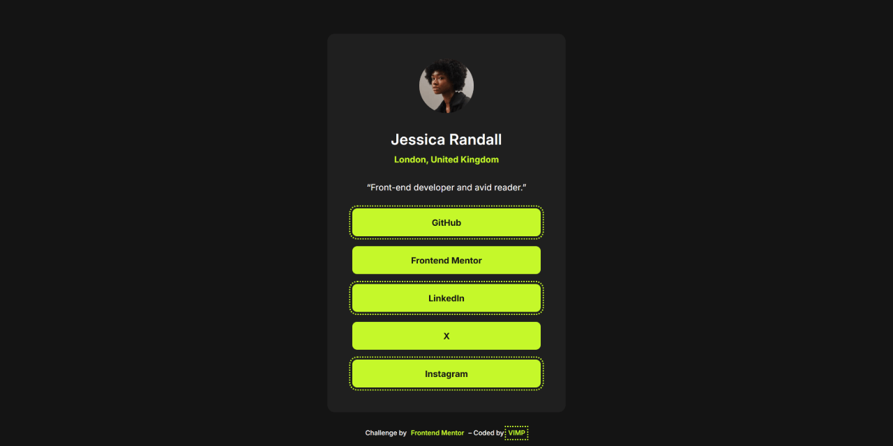
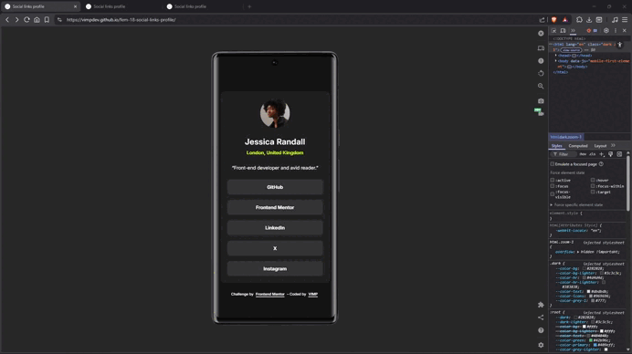

# 🚀 Social Links Profile &ndash; Frontend Mentor

A responsive social links profile card built with semantic HTML and modern CSS, focusing on accessibility, clean structure and maintainable styling.

This is a solution to the [Social links profile challenge on Frontend Mentor](https://www.frontendmentor.io/challenges/social-links-profile-UG32l9m6dQ).

---

## 🎬 Demo

---

## 🔗 Links

- 🌎 [Live site](https://vimpdev.github.io/fem-18-social-links-profile/)
- 📌 [Frontend Mentor Solution](https://www.frontendmentor.io/solutions/social-links-profile-card-semantic-html-and-accessible-css-5lmXpDJnR8)

---

## 🎯 Features

- Semantic HTML structure
- Accessible focus states using `:focus-visible`
- Responsive layout using modern CSS (`clamp`, Grid)
- Clean component structure with BEM methodology
- Custom properties (CSS variables) for theming

---

## 📸 Screenshots

| 📱 Mobile | 📲 Tablet |
| --- | --- |
|  |  |

| 🖥️ Desktop | 🖱️ Interaction |
| --- | --- |
|  |  |

---

## 🛠️ Built with

- Semantic HTML5
- CSS custom properties
- CSS Grid
- Mobile-first workflow

---

## 🧠 What I learned

- Structuring components using **BEM naming conventions**
- Writing **accessible HTML** (semantic elements, meaningful alt text, focus states)
- Building responsive layouts with modern techniques like `clamp()` and `dvh`
- Applying a **clean CSS architecture** (tokens, base, components, utilities)

---

## 🤖 AI Collaboration

AI tools were used as a learning and review aid throughout this project:

- Supported code review and validation of best practices
- Helped refine semantic HTML and accessibility decisions
- Provided guidance on CSS structure and maintainability

All implementation and final decisions were made independently.

## 👤 Author

- Frontend Mentor &ndash; [@vimpdev](https://www.frontendmentor.io/profile/vimpdev)

---